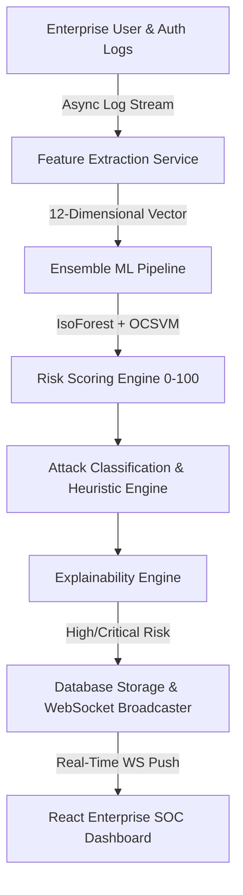

# SentinelAI - Enterprise AI Behavioral Anomaly Detection & SOC Platform

Developed for **Honeywell Hackathon 2026**.

SentinelAI is an enterprise-grade, real-time Security Operations Center (SOC) platform powered by ensemble Machine Learning models (**Isolation Forest + One-Class SVM**). It learns normal employee baseline behavior from authentication and activity logs, detects anomalous access patterns in real time, classifies attack vectors, generates explainable 0-100 risk scores with plain-language rationales, and streams live security alerts via WebSockets.

---

## 🏛️ System Architecture



---

## 🚀 Tech Stack

### Backend & Machine Learning
- **Framework**: Python 3.11+, FastAPI, Pydantic v2
- **ORM & Database**: SQLAlchemy 2.0 Async, SQLite (Local Fallback) / PostgreSQL + AsyncPG
- **Security & Auth**: JWT (Access & Refresh Tokens), Passlib (Bcrypt), RBAC (Admin, SOC Analyst, Viewer)
- **Machine Learning**: Scikit-Learn (Isolation Forest, One-Class SVM), NumPy, Pandas, Joblib
- **Real-Time Streaming**: WebSockets, Asyncio Event Pipeline

### Frontend
- **Framework**: React 18, TypeScript, Vite
- **Styling**: TailwindCSS (Enterprise Dark Palette: Slate, Blue, Emerald, Red for Critical Alerts)
- **Data Visualization**: Recharts (Risk Trends, Attack Timelines, Heatmaps, Severity Pie)
- **State & Router**: React Query v5, Zustand, React Router v6
- **Icons**: Lucide React

### Deployment & Testing
- **Containerization**: Docker, Docker Compose
- **Testing**: Pytest, Pytest-Asyncio, HTTPX

---

## ⚡ Features & Capabilities

1. **Synthetic Enterprise Generator**:
   - Generates realistic corporate hierarchies, multi-country locations (US, UK, Germany, India, Canada, France, Japan), work patterns (Standard Shift, 24/7 Shift, Remote, Hybrid), devices, MAC addresses, and normal log activity.
2. **8 Realistic Attack Scenario Simulators**:
   - `Brute Force`: Multi-failed password spikes from single IP.
   - `Credential Stuffing`: Compromised credentials tried across unknown devices and suspicious proxy IPs.
   - `Impossible Travel`: Rapid geographic velocity jump (e.g., US to Russia in 15 minutes).
   - `Device Spoofing`: Unrecognized MAC/OS fingerprint masquerading with low device trust score.
   - `Privilege Escalation`: Sudden administrative endpoint usage by standard user.
   - `Lateral Movement`: Off-hours access to rare internal subnets.
   - `Insider Threat`: Off-hours access to sensitive code repositories and financial databases.
   - `Slow Data Exfiltration`: Prolonged sessions transferring high-volume data payloads.
3. **Transparent 0-100 Risk Scoring Engine**:
   - Combines ML anomaly probabilities, behavior hour deviations, device trust scores, failed login counts, geographic velocity, and account privilege levels.
4. **Natural Language Explainability**:
   - Converts raw ML output into plain-language SOC analyst explanations (e.g., *"First login from Germany exhibiting impossible geographic velocity (850 km/h)"*).
5. **Real-Time WebSocket Stream**:
   - Live monitoring dashboard updates instantly without page refresh.

---

## 🛠️ Installation & Running Locally

### 1. Prerequisites
- Python 3.11+
- Node.js 18+ & npm

### 2. Backend Setup
```bash
cd backend
python -m venv venv
# On Windows:
venv\Scripts\activate
# On Linux/macOS:
source venv/bin/activate

pip install -r requirements.txt
python main.py
```
Backend will start on `http://localhost:8000`. OpenAPI documentation available at `http://localhost:8000/docs`.

### 3. Frontend Setup
```bash
cd frontend
npm install
npm run dev
```
Frontend will start on `http://localhost:3000`.

### 4. Demo Login Credentials
- **Email**: `admin@honeywell.com`
- **Password**: `SentinelPass2026!`

---

## 🐳 Docker Deployment (One-Command Startup)

To build and run the entire stack (FastAPI Backend, React Frontend, PostgreSQL, Redis) in Docker:

```bash
docker-compose up --build
```

Access the SOC Platform at `http://localhost:3000`.

---

## 🧪 Running Automated Tests

```bash
pytest backend/tests/test_sentinel.py -v
```

---

## ⏱️ 8-Minute Hackathon Demo Script

1. **0:00 - 1:00**: **Problem & Vision**: Introduce Honeywell's need for real-time behavioral cybersecurity monitoring beyond traditional static signature rules.
2. **1:00 - 2:30**: **Dashboard Overview**: Walk through the SOC Dashboard KPIs (Total Users, Active Sessions, Today's Alerts, Risk Score 0-100, Detection Latency: 14.5ms).
3. **2:30 - 4:00**: **Live Attack Injection**: Click *"Inject Scenario: Impossible Travel"* or *"Brute Force"*. Watch the real-time WebSocket ticker stream the event live into the UI.
4. **4:00 - 5:30**: **Alert Investigation & Explainability**: Open an alert detail drawer to show plain-language explainability reasons and recommended SOC remediation actions.
5. **5:30 - 6:30**: **Behavior Profiles & Threat Explorer**: Demonstrate how SentinelAI learns baseline normal login hours and trusted devices per employee.
6. **6:30 - 7:30**: **ML Analytics**: Show model precision (95.4%), recall (94.1%), F1-Score (0.947), and confusion matrix.
7. **7:30 - 8:00**: **Conclusion & Enterprise Readiness**: Highlight clean architecture, FastAPI + React 18, Docker readiness, and scalability.

---

## 📄 License
Honeywell Hackathon Project 2026. Production MVP Edition.
